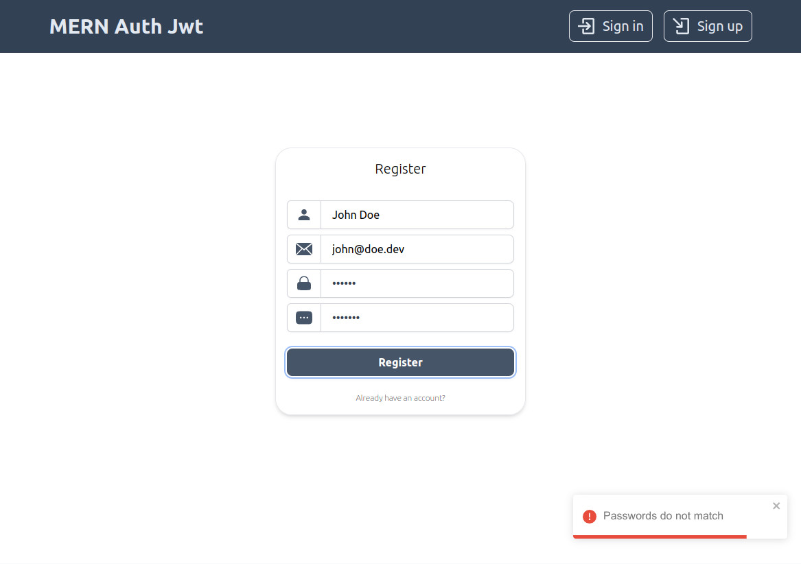
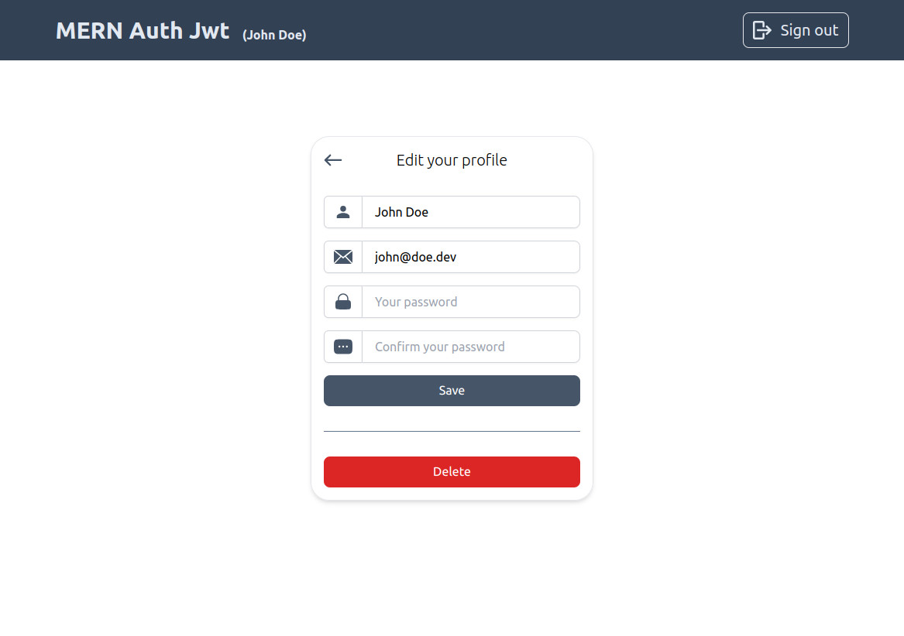

# mern-auth-jwt
MERN authorization with jwt.
Http only cookie.

```
$ npm install
$ npm run dev
```

.env variables
```
MONGO_URI=...
JWT_SECRET=...
JWT_EXPIRES=3600000
VERSION=v1
```


### Login Page


### Invalid login (no user)


### Register Page



### Profile Page


### Edit Profile Page



### Delete Profile Page


